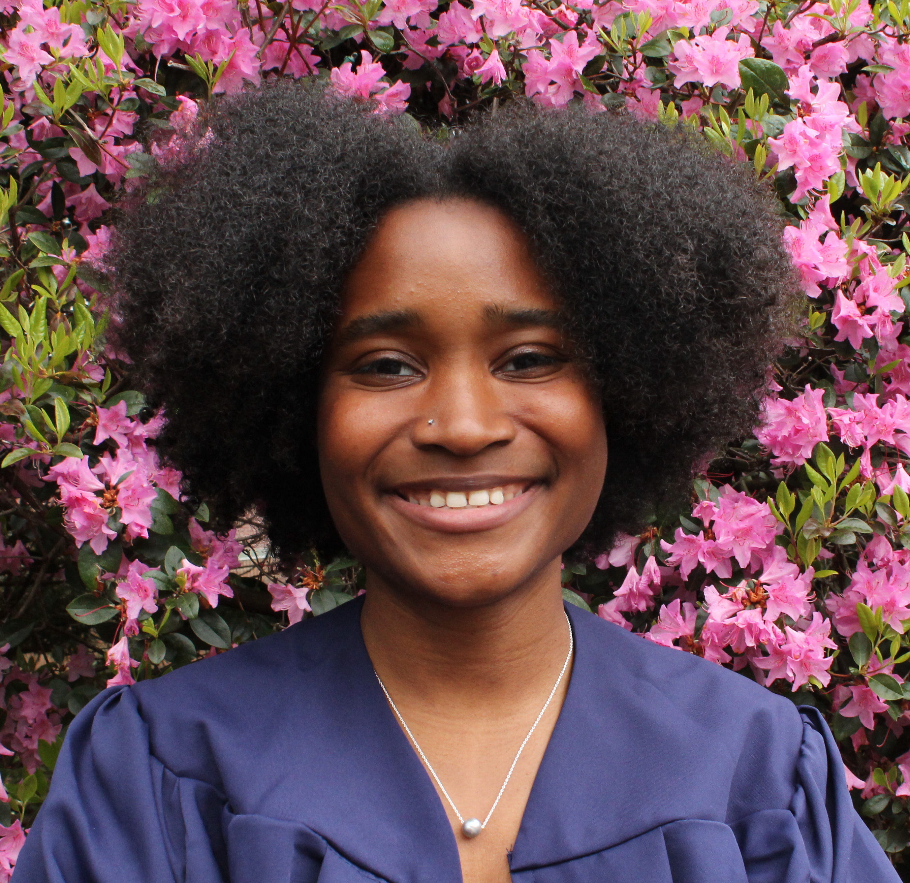

## About Me
I am a MS student in the UConn EEB department interested in Parasite imaging and phylogenetics. Parasitic copepod taxonomy, systematics, and host association.

[My CV](PDFs/CV2023_GH.pdf)

[Contact Info](contact-info.html)


